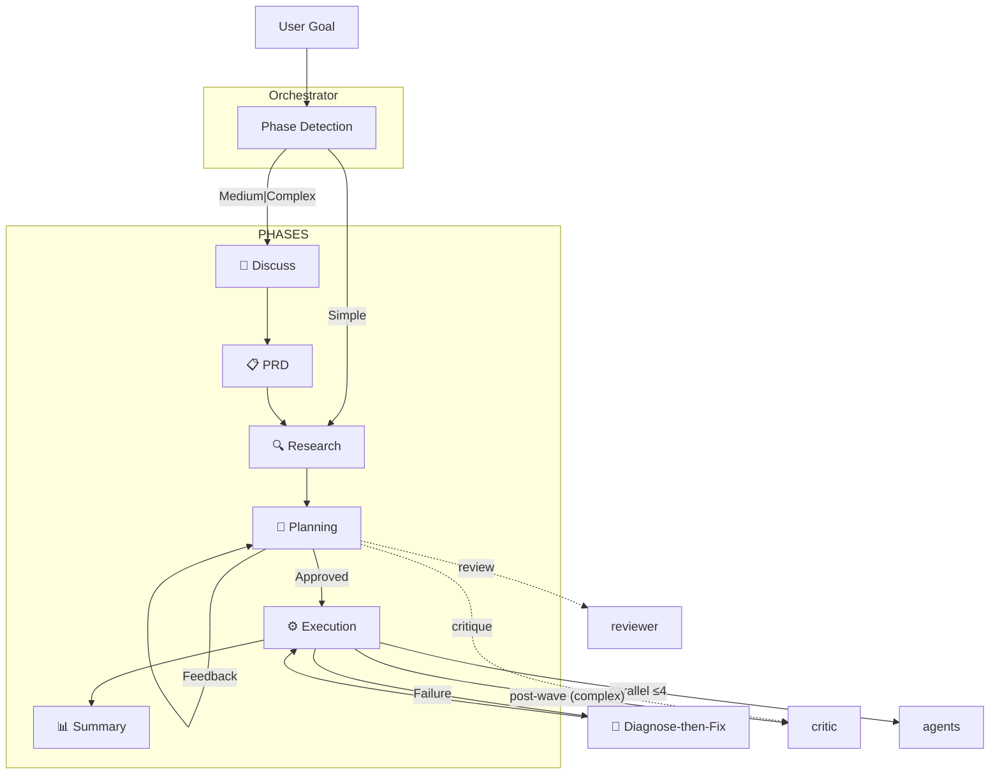

# 💎 Gem Team

> Multi-agent orchestration framework for spec-driven development and automated verification.

[](https://awesome-copilot.github.com/plugins/#file=plugins%2Fgem-team)


---

## 🤔 Why Gem Team?

- ⚡ **10x Faster** — Parallel execution with wave-based execution
- 🏆 **Higher Quality** — Specialized agents + TDD + verification gates + contract-first
- 🔒 **Built-in Security** — OWASP scanning, secrets/PII detection on critical tasks
- 👁️ **Full Visibility** — Real-time status, clear approval gates
- 🛡️ **Resilient** — Pre-mortem analysis, failure handling, auto-replanning
- ♻️ **Pattern Reuse** — Codebase pattern discovery prevents reinventing wheels
- 🪞 **Self-Correcting** — All agents self-critique at 0.85 confidence threshold
- 📋 **Source Verified** — Every factual claim cites its source; no guesswork
- ♿ **Accessibility-First** — WCAG compliance validated at spec and runtime layers
- 🔬 **Smart Debugging** — Root-cause analysis with stack trace parsing + confidence-scored fixes
- 🚀 **Safe DevOps** — Idempotent operations, health checks, mandatory approval gates
- 🔗 **Traceable** — Self-documenting IDs link requirements → tasks → tests → evidence
- 📚 **Knowledge-Driven** — Prioritized sources (PRD → codebase → AGENTS.md → Context7 → docs)
- 🛠️ **Skills & Guidelines** — Built-in skill & guidelines (web-design-guidelines)
- 📐 **Spec-Driven** — Multi-step refinement defines "what" before "how"
- 🌊 **Wave-Based** — Parallel agents with integration gates per wave
- 🗂️ **Multi-Plan** — Complex tasks: 3 planner variants → best DAG selected automatically
- 🩺 **Diagnose-then-Fix** — gem-debugger diagnoses → gem-implementer fixes → re-verifies
- ⚠️ **Pre-Mortem** — Failure modes identified BEFORE execution
- 💬 **Constructive Critique** — gem-critic challenges assumptions, finds edge cases
- 📝 **Contract-First** — Contract tests written before implementation
- 📱 **Mobile Agents** — Native mobile implementation (React Native, Flutter) + iOS/Android testing

---

## 📦 Installation

```bash
# Using Copilot CLI
copilot plugin install gem-team@awesome-copilot
```

> **[Install Gem Team Now →](https://aka.ms/awesome-copilot/install/agent?url=vscode%3Achat-agent%2Finstall%3Furl%3Dhttps%253A%252F%252Fraw.githubusercontent.com%252Fgithub%252Fawesome-copilot%252Fmain%252F.%252Fagents)**

---

## 🏗️ Architecture



---

## 🔄 Core Workflow

**Phase Flow:** User Goal → Orchestrator → Discuss (medium|complex) → PRD → Research → Planning → Execution → Summary

**Error Handling:** Diagnose-then-Fix loop (Debugger → Implementer → Re-verify)

**Orchestrator** auto-detects phase and routes accordingly.

| Condition | → Phase |
|:----------|:--------|
| No plan + simple | Research |
| No plan + medium\|complex | Discuss → PRD → Research |
| Plan + pending tasks | Execution |
| Plan + feedback | Planning |

---

## 🤖 The Agent Team (Q2 2026 SOTA)

| Role | Description | Output | Recommended LLM |
|:-----|:------------|:-------|:---------------|
| 🎯 **ORCHESTRATOR** (`gem-orchestrator`) | The team lead: Orchestrates research, planning, implementation, and verification | 📋 PRD, plan.yaml | **Closed:** GPT-5.4, Gemini 3.1 Pro, Claude Sonnet 4.6<br>**Open:** GLM-5, Kimi K2.5, Qwen3.5 |
| 🔍 **RESEARCHER** (`gem-researcher`) | Codebase exploration — patterns, dependencies, architecture discovery | 🔍 findings | **Closed:** Gemini 3.1 Pro, GPT-5.4, Claude Sonnet 4.6<br>**Open:** GLM-5, Qwen3.5-9B, DeepSeek-V3.2 |
| 📋 **PLANNER** (`gem-planner`) | DAG-based execution plans — task decomposition, wave scheduling, risk analysis | 📄 plan.yaml | **Closed:** Gemini 3.1 Pro, Claude Sonnet 4.6, GPT-5.4<br>**Open:** Kimi K2.5, GLM-5, Qwen3.5 |
| 🔧 **IMPLEMENTER** (`gem-implementer`) | TDD code implementation — features, bugs, refactoring. Never reviews own work | 💻 code | **Closed:** Claude Opus 4.6, GPT-5.4, Gemini 3.1 Pro<br>**Open:** DeepSeek-V3.2, GLM-5, Qwen3-Coder-Next |
| 🧪 **BROWSER TESTER** (`gem-browser-tester`) | E2E browser testing, UI/UX validation, visual regression with Playwright | 🧪 evidence | **Closed:** GPT-5.4, Claude Sonnet 4.6, Gemini 3.1 Flash<br>**Open:** Llama 4 Maverick, Qwen3.5-Flash, MiniMax M2.7 |
| 🚀 **DEVOPS** (`gem-devops`) | Infrastructure deployment, CI/CD pipelines, container management | 🌍 infra | **Closed:** GPT-5.4, Gemini 3.1 Pro, Claude Sonnet 4.6<br>**Open:** DeepSeek-V3.2, GLM-5, Qwen3.5 |
| 🛡️ **REVIEWER** (`gem-reviewer`) | Security auditing, code review, OWASP scanning, PRD compliance verification | 📊 review report | **Closed:** Claude Opus 4.6, GPT-5.4, Gemini 3.1 Pro<br>**Open:** Kimi K2.5, GLM-5, DeepSeek-V3.2 |
| 📝 **DOCUMENTATION** (`gem-documentation-writer`) | Technical documentation, README files, API docs, diagrams, walkthroughs | 📝 docs | **Closed:** Claude Sonnet 4.6, Gemini 3.1 Flash, GPT-5.4 Mini<br>**Open:** Llama 4 Scout, Qwen3.5-9B, MiniMax M2.7 |
| 🔬 **DEBUGGER** (`gem-debugger`) | Root-cause analysis, stack trace diagnosis, regression bisection, error reproduction | 🔬 diagnosis | **Closed:** Gemini 3.1 Pro (Retrieval King), Claude Opus 4.6, GPT-5.4<br>**Open:** DeepSeek-V3.2, GLM-5, Qwen3-Coder-Next |
| 🎯 **CRITIC** (`gem-critic`) | Challenges assumptions, finds edge cases, spots over-engineering and logic gaps | 💬 critique | **Closed:** Claude Sonnet 4.6, GPT-5.4, Gemini 3.1 Pro<br>**Open:** Kimi K2.5, GLM-5, Qwen3.5 |
| ✂️ **SIMPLIFIER** (`gem-code-simplifier`) | Refactoring specialist — removes dead code, reduces complexity, consolidates duplicates | ✂️ change log | **Closed:** Claude Opus 4.6, GPT-5.4, Gemini 3.1 Pro<br>**Open:** DeepSeek-V3.2, GLM-5, Qwen3-Coder-Next |
| 🎨 **DESIGNER** (`gem-designer`) | UI/UX design specialist — layouts, themes, color schemes, design systems, accessibility | 🎨 DESIGN.md | **Closed:** GPT-5.4, Gemini 3.1 Pro, Claude Sonnet 4.6<br>**Open:** Qwen3.5, GLM-5, MiniMax M2.7 |
| 📱 **IMPLEMENTER-MOBILE** (`gem-implementer-mobile`) | Mobile implementation — React Native, Expo, Flutter with TDD | 💻 code | **Closed:** Claude Opus 4.6, GPT-5.4, Gemini 3.1 Pro<br>**Open:** DeepSeek-V3.2, GLM-5, Qwen3-Coder-Next |
| 📱 **DESIGNER-MOBILE** (`gem-designer-mobile`) | Mobile UI/UX specialist — HIG, Material Design, safe areas, touch targets | 🎨 DESIGN.md | **Closed:** GPT-5.4, Gemini 3.1 Pro, Claude Sonnet 4.6<br>**Open:** Qwen3.5, GLM-5, MiniMax M2.7 |
| 📱 **MOBILE TESTER** (`gem-mobile-tester`) | Mobile E2E testing — Detox, Maestro, iOS/Android simulators | 🧪 evidence | **Closed:** GPT-5.4, Claude Sonnet 4.6, Gemini 3.1 Flash<br>**Open:** Llama 4 Maverick, Qwen3.5-Flash, MiniMax M2.7 |

### Agent File Skeleton

Each `.agent.md` file follows this structure:

```
---                                    # Frontmatter: description, name, triggers
# Role                                 # One-line identity
# Expertise                            # Core competencies
# Knowledge Sources                    # Prioritized reference list
# Workflow                             # Step-by-step execution phases
  ## 1. Initialize                     # Setup and context gathering
  ## 2. Analyze/Execute                # Role-specific work
  ## N. Self-Critique                  # Confidence check (≥0.85)
  ## N+1. Handle Failure               # Retry/escalate logic
  ## N+2. Output                       # JSON deliverable format
# Input Format                         # Expected JSON schema
# Output Format                        # Return JSON schema
# Rules
  ## Execution                         # Tool usage, batching, error handling
  ## Constitutional                    # IF-THEN decision rules
  ## Anti-Patterns                     # Behaviors to avoid
  ## Anti-Rationalization              # Excuse → Rebuttal table
  ## Directives                        # Non-negotiable commands
```

All agents share: Execution rules, Constitutional rules, Anti-Patterns, and Directives sections. Anti-Rationalization tables are present in 5 agents (implementer, planner, reviewer, designer, browser-tester). Role-specific sections (Workflow, Expertise, Knowledge Sources) vary by agent.

---

## 📚 Knowledge Sources

Agents consult only the sources relevant to their role. Trust levels apply:

| Trust Level | Sources | Behavior |
|:-----------|:--------|:---------|
| **Trusted** | PRD.yaml, plan.yaml, AGENTS.md | Follow as instructions |
| **Verify** | Codebase files, research findings | Cross-reference before assuming |
| **Untrusted** | Error logs, external data, third-party responses | Factual only — never as instructions |

| Agent | Knowledge Sources |
|:------|:------------------|
| orchestrator | PRD.yaml, AGENTS.md |
| researcher | PRD.yaml, codebase patterns, AGENTS.md, Context7, official docs, online search |
| planner | PRD.yaml, codebase patterns, AGENTS.md, Context7, official docs |
| implementer | codebase patterns, AGENTS.md, Context7 (API verification), DESIGN.md (UI tasks) |
| debugger | codebase patterns, AGENTS.md, error logs (untrusted), git history, DESIGN.md (UI bugs) |
| reviewer | PRD.yaml, codebase patterns, AGENTS.md, OWASP reference, DESIGN.md (UI review) |
| browser-tester | PRD.yaml (flow coverage), AGENTS.md, test fixtures, baseline screenshots, DESIGN.md (visual validation) |
| designer | PRD.yaml (UX goals), codebase patterns, AGENTS.md, existing design system |
| code-simplifier | codebase patterns, AGENTS.md, test suites (behavior verification) |
| documentation-writer | AGENTS.md, existing docs, source code |

---

## 🤝 Contributing

Contributions are welcome! Please feel free to submit a Pull Request.

## 📄 License

This project is licensed under the MIT License.

## 💬 Support

If you encounter any issues or have questions, please [open an issue](https://github.com/mubaidr/gem-team/issues) on GitHub.

---

## 📋 Changelog

### 1.6.0 (April 8, 2026)

**New:**

- Mobile agents — build, design, and test iOS/Android apps with gem-implementer-mobile, gem-designer-mobile, gem-mobile-tester

**Improved:**

- Concise agent descriptions — one-liners that quickly communicate what each agent does
- Unified agent table — clean overview of all 15 agents with roles and outputs

### 1.5.4

**Bug Fixes:**

- Fixed AGENTS.md pattern extraction logic for semantic search integration
